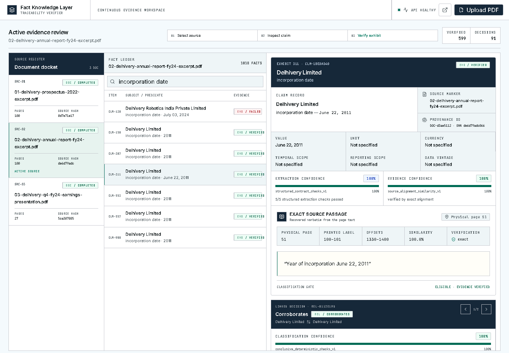
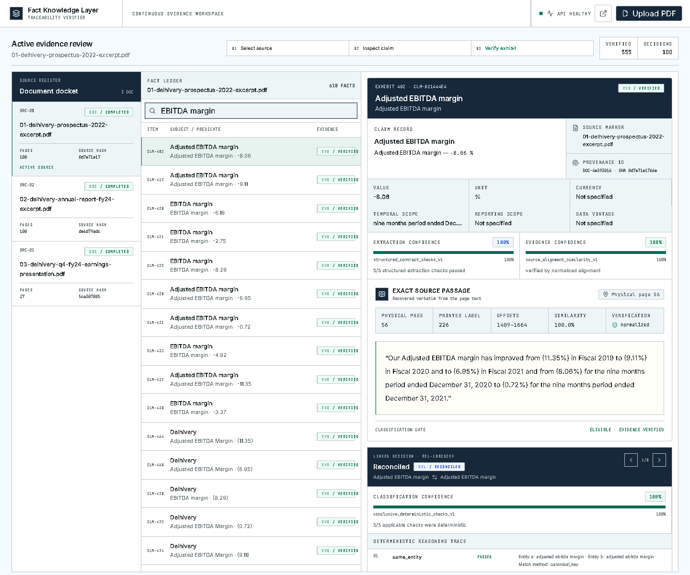
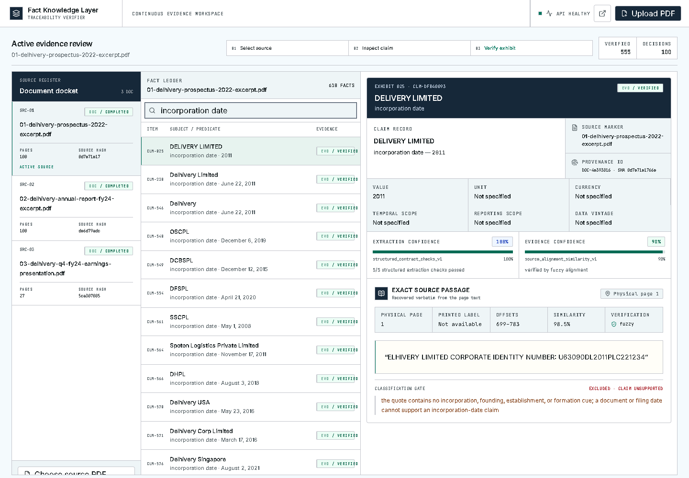

# Fact Knowledge Layer

I built this to answer a fairly simple question: when an AI extracts a fact from a PDF, can I see exactly why I should trust it?

The model proposes facts. The application then checks each quote against the stated PDF page, recovers the real source text, normalizes comparable values, and runs a deterministic relationship classifier. The model never gets to label two facts as corroborating or contradictory by itself.

**Live application:** https://fact-knowledge-layer-npbn.onrender.com/
**API documentation:** https://fact-knowledge-layer-npbn.onrender.com/docs



_A selected fact opens as an evidence dossier. This example shows the recovered quote, physical PDF page 51, printed label 100–101, page-local offsets and separate confidence scores._

## Setup and Run Instructions

You need Python 3.11–3.14, Node.js 20+ and a Gemini API key.

```bash
git clone https://github.com/tanujkapoor-cmd/fact-knowledge-layer.git
cd fact-knowledge-layer
python -m venv .venv
python -m pip install -e ".[dev]"
```

Activate the virtual environment, copy `.env.example` to `.env`, and add your key:

```dotenv
FKL_LLM_PROVIDER=gemini
FKL_LLM_MODEL=gemini-3.5-flash-lite
FKL_GEMINI_API_KEY=your_key_here
```

Start the backend:

```bash
uvicorn backend.main:app --reload --host 127.0.0.1 --port 8000
```

Start the React app in a second terminal:

```bash
cd frontend
npm ci
npm run dev
```

Open `http://127.0.0.1:5173`. FastAPI's interactive docs are at `http://127.0.0.1:8000/docs`.

To run the checks:

```bash
pytest
cd frontend && npm run lint && npm run build
```

## Video Demo

> **Demo video:** [Watch the 3-minute demo](https://drive.google.com/file/d/1dJkN0NMonkdqzXWYNVPbzFp0fAA5ABNP/view)

The final recording must be three minutes or less. I prepared a timed walkthrough and the exact narration in [`docs/video-demo-script.md`](docs/video-demo-script.md). It covers the four cases requested in the assignment:

1. corroboration across two documents;
2. a genuine or likely contradiction;
3. a value difference explained by context; and
4. an extraction, evidence or provider failure that is kept with its reason.

The exact facts used for those four cases are in [`sample_data/verified_demo_cases.json`](sample_data/verified_demo_cases.json).

## What the Interface Shows



_A difference is marked `reconciled` because the reporting periods differ. The ordered checks are shown underneath the decision, so the result can be audited without reading a generated explanation._



_The year in this corporate identity number was mistaken for an incorporation date. The quote really exists, but it does not support the claim, so the fact stays visible and is excluded from comparison._

## Approach

```text
React evidence workspace
        |
     FastAPI ---- SQLite
        |
        +-- PyMuPDF page ingestion
        +-- Gemini structured extraction
        +-- quote verification and source-text recovery
        +-- deterministic normalization
        `-- deterministic relationship classification
```

### Ingestion and evidence

PyMuPDF reads the document one page at a time. I store the one-based physical PDF page, an optional printed page label, and page-local character offsets. This matters for the supplied excerpts because a physical page in the small PDF may still carry the page number from the original report.

The extraction prompt asks Gemini for a subject, predicate, value, unit or currency, temporal scope, reporting scope, data vintage, quote and page number. That output is only a candidate. The verifier must find the quote on the stated page. If whitespace or line-break hyphenation changed, it maps the match back to the actual substring from the PDF so the UI still shows verbatim evidence.

A quote that cannot be verified is not quietly dropped. It remains in the database with a failure reason and is left out of relationship classification.

### Normalization and relationships

`backend/reasoning/normalize.py` and `backend/reasoning/classify.py` are ordinary deterministic Python. They do not call an LLM. Alias rules live in `config/aliases.example.json`, and number handling uses `Decimal` rather than binary floating point.

Candidate pairs are first blocked by canonical entity and predicate. The classifier then checks, in order:

1. entity;
2. predicate;
3. normalized value;
4. written precision and rounding;
5. reporting period;
6. data vintage;
7. unit;
8. currency; and
9. reporting scope.

The result is `corroborates`, `contradicts`, `reconciled` or `uncertain`. Every decision includes the ordered machine-readable trace shown in the interface. A model may only help with a bounded ambiguous entity-name match; it still cannot choose the final class.

### Confidence and recovery

I kept three confidence measures separate because they answer different questions:

- **Extraction confidence:** did the model satisfy the structured fact contract?
- **Evidence confidence:** how closely did the quote align with the source page?
- **Classification confidence:** how much of the relationship decision was resolved by deterministic checks?

Uploads are hashed, so uploading the same completed PDF reuses its result. Processing runs through FastAPI `BackgroundTasks`; successful batches are checkpointed and provider calls have bounded retries. A failed duplicate can be explicitly retried instead of being stuck forever.

### API

- `POST /documents` uploads a PDF. Add `?retry_failed=true` to retry identical failed bytes.
- `GET /documents/{id}` returns status, progress, checkpoint and failure information.
- `GET /documents/{id}/facts` returns facts with evidence and both fact-level confidence scores.
- `GET /relationships` returns filterable decisions, both facts and the full reasoning trace.

## Evaluation

I hand-labelled 15 facts and eight relationship pairs from the starter documents. The saved run found all 15 labelled facts, matched all 15 exact quotes, and classified seven of the eight relationship pairs. The eighth pair is the manually reviewed employee-count contradiction inside one PDF; the current production candidate generator only creates cross-document pairs.

| Check | Result |
| --- | ---: |
| Extraction recall | 100% |
| Exact evidence quote rate | 100% |
| Relationship decisions found and correct | 7 / 8 |
| Extraction precision on the labelled dense pages | 13.5% |

The precision number is a useful warning, not a headline result. Only the hand-labelled facts count as true positives, so every other verified candidate on those pages counts against precision. This small set is a smoke test, not a general accuracy claim.

To evaluate another labelled set:

```bash
python -m evaluation.export_predictions \
  --api-base http://127.0.0.1:8000 \
  --document DOCUMENT_ID --format evaluation \
  --output evaluation/predictions.json

python -m evaluation.run_eval \
  --ground-truth evaluation/ground_truth.json \
  --predictions evaluation/predictions.json \
  --output evaluation/results/eval_results.json
```

The starter-run export is in [`sample_data/delhivery_sample_output.json`](sample_data/delhivery_sample_output.json). Labels, predictions and the confusion matrix are under [`evaluation/`](evaluation/).

## Deployment

The included multi-stage `Dockerfile` builds the React client and serves it from the FastAPI process. `render.yaml` deploys one worker because the assignment asks for a simple in-memory status dictionary. `FKL_GEMINI_API_KEY` must be set as a Render secret and must never be committed.

The free Render filesystem is temporary. It is fine for reviewing the assignment, but uploaded data can disappear after a restart. A longer-lived version should attach a persistent disk at `/data` or move the same relational schema to managed PostgreSQL.

## Limitations and Next Steps

- Scanned PDFs need OCR; this version expects extractable text.
- Tables, charts and multi-column layouts can still produce imperfect reading order.
- Entity aliases are intentionally conservative. An unfamiliar company naming pattern can remain `uncertain` instead of being forced into a match.
- Currency conversion needs an explicit dated rate table. The system does not fetch or guess a live rate.
- The background-task design assumes one application worker. I would use a durable queue only when the document volume justifies it.
- Free Gemini capacity can return transient `503` errors. Retries and checkpoints reduce repeated work, but cannot guarantee provider availability.
- Relationship generation currently compares documents, not two facts from the same document. That is why the manually validated employee-count contradiction is recorded in evaluation but is not injected into the product output.

## Additional Notes

I did not add a graph database, vector store, RAG pipeline, Celery or a multi-agent framework. The document collection is small, and those tools would add moving parts without improving the core evidence problem.

The important boundary is the same one I used in my internship work: the model interprets unstructured material, while deterministic services and trusted source text decide what the system can rely on.

More detailed contracts are in [`docs/architecture.md`](docs/architecture.md), [`docs/api.md`](docs/api.md), [`docs/frontend.md`](docs/frontend.md) and [`docs/evaluation.md`](docs/evaluation.md). Credentials, uploaded PDFs and local databases are excluded from Git.
